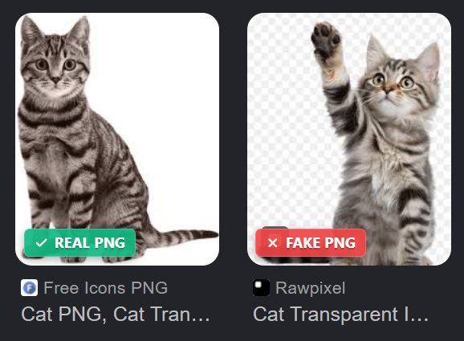

   
  
   
  <h1>🔍 PNG-FILTER</h1>
  
<strong>Verifying Authenticity in Real-Time</strong>

  
<i>A Premium, High-Performance Chrome Extension to Detect and Flag Fake PNGs Instantly in the Google Search Grid.</i>

   

  

    
    
    
    
    
  

   
  

    
  

   

---

## 📽️ The PNG-Filter Vision

**PNG-Filter** solves a frustrating, daily digital workflow bottleneck for designers, developers, and creators. We've all searched for a transparent PNG asset, only to download a file with a fake, baked-in gray and white checkerboard background. This extension integrates seamlessly into Google Image Search to verify transparency under the hood and overlay visual verification labels before you ever click or download a result.

  <table border="0" cellspacing="0" cellpadding="20">
    <tr>
      <td width="300" valign="top" style="border: 1px solid #333; border-radius: 15px; background: rgba(255,255,255,0.02); padding: 15px;">
        <h3>⚡ Instant Scan</h3>
        
Automatically scans the Google Images results grid in one go as the page loads and content appears.

      </td>
      <td width="300" valign="top" style="border: 1px solid #333; border-radius: 15px; background: rgba(255,255,255,0.02); padding: 15px;">
        <h3>🏷️ Smart Badges</h3>
        
Dynamic indicator pills (<code>Real PNG</code> / <code>Fake PNG</code>) float directly on thumbnails with blur effects.

      </td>
    </tr>
    <tr>
      <td width="300" valign="top" style="border: 1px solid #333; border-radius: 15px; background: rgba(255,255,255,0.02); padding: 15px;">
        <h3>⏳ Concurrency Queue</h3>
        
Restricts background operations to 4 parallel image scans to preserve system RAM and prevent network spikes.

      </td>
      <td width="300" valign="top" style="border: 1px solid #333; border-radius: 15px; background: rgba(255,255,255,0.02); padding: 15px;">
        <h3>💾 Memory Caching</h3>
        
An in-memory LRU cache stores up to 50 validated URLs so you never fetch the same image twice.

      </td>
    </tr>
  </table>

---

## 🚀 Local Installation

To load and test this extension on your machine:

1. Clone or download this repository.
2. Open Google Chrome and navigate to `chrome://extensions`.
3. In the top-right corner, toggle the **Developer mode** switch to **ON**.
4. Click the **Load unpacked** button in the top-left corner.
5. Select the folder containing these files (`C:\Codes\projects\png-filter`).
6. Open [Google Images](https://images.google.com) and search for a transparent image (e.g. `cat transparent png`) to see it in action!

---

## 🔒 Privacy & Safety

- **Local Execution:** All calculations run locally in your browser context using `OffscreenCanvas`.
- **Zero Tracking:** No search queries, browsing history, or identifiers are logged or sent to any server.
- **No External Dependencies:** Standard vanilla APIs ensure there is no hidden tracking code.

---

## 📄 License

This project is licensed under the MIT License.
